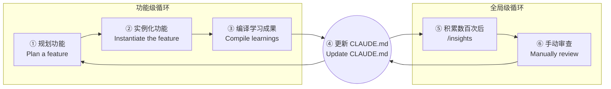

# Vibe Coding 开发流程

用 Claude Code 进行一次完整的 Vibe Coding 开发。

<!-- 开发者：花小琪 -->

## 核心理念

Vibe Coding 不是一个指令一个动作的机械过程，而是**人与 AI 的协作循环**：

- 你负责**想清楚要什么**（意图、约束、验收标准）
- AI 负责**高效实现**（编码、调试、测试）
- 双方共同**迭代优化**（审查、重构、精炼）

## 迭代循环

Vibe Coding 的核心不是一次性交付，而是**两个相互驱动的迭代循环**：

**功能级循环（Local）**——每次开发一个功能时重复：
- ① 规划功能：想清楚要做什么，描述需求
- ② 实例化功能：Claude Code 编码实现
- ③ 编译学习成果：审查代码，总结本次开发中的经验
- ④ 更新 CLAUDE.md：将经验写入项目配置，让下次开发更精准

**全局级循环（Global）**——积累数百次交互后触发：
- ⑤ `/insights`：Claude Code 自动提炼全局洞察
- ⑥ 手动审查：开发者审核并确认这些洞察
- ④ 更新 CLAUDE.md：将全局洞察固化到配置中

两个循环通过 **CLAUDE.md** 互相驱动——功能级循环不断积累经验，全局级循环定期提炼升华。

### 快速参考

| 阶段 | 核心动作 | 关键命令 |
|------|----------|----------|
| **规划功能** | 想清楚需求、描述约束 | Plan 模式 |
| **实例化功能** | 编码实现、迭代修改 | `/compact`、`/review` |
| **编译学习成果** | 审查代码、总结经验 | `/review`、`/simplify` |
| **更新 CLAUDE.md** | 将经验写入配置 | `/memory`、`/init` |
| **全局洞察** | 积累数百次后提炼 | `/insights` |

## 关键原则

**1. 先想后说**

在给 AI 下指令前，自己先想清楚：
- 要实现什么功能？
- 有哪些约束条件？
- 怎样算完成？

模糊的需求 = 模糊的输出。哪怕只写三个关键词，也比一句话什么都说要强。

**2. 小步快跑**

不要一次性让 AI 完成整个项目。把大任务拆成小步骤：
- 每步完成让 AI 运行测试确认
- 发现问题立即修正，不要攒到最后
- 用 `/compact` 定期压缩上下文

**3. 提供上下文**

AI 不知道你的项目背景。主动提供：
- 技术栈和项目结构（写在 CLAUDE.md）
- 相关代码文件的位置
- 编码规范和特殊约定

**4. 审查不省略**

AI 生成的代码需要审查：
- 检查逻辑正确性，不要盲目信任
- 用 `/review` 让 AI 自查
- 关注安全问题（注入、权限、数据泄露）

接下来，按阶段详细说明。
